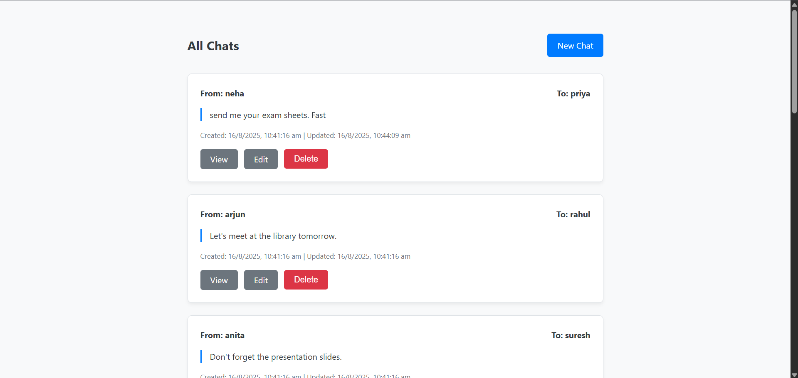
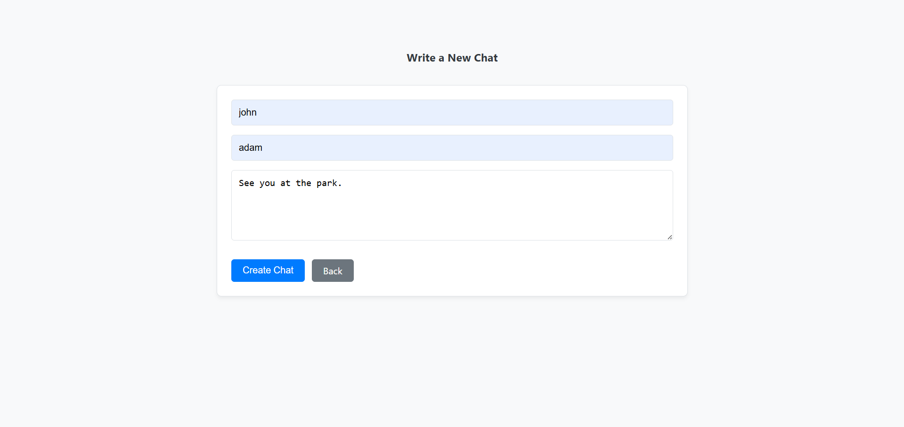
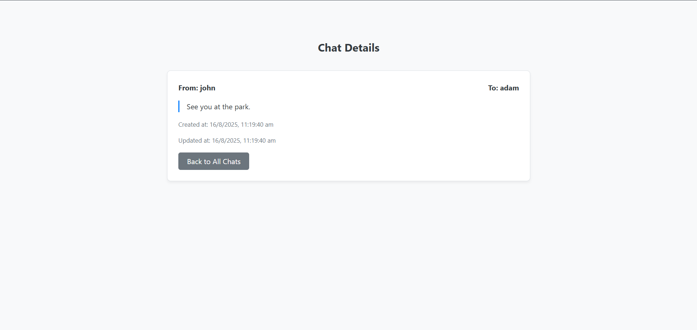
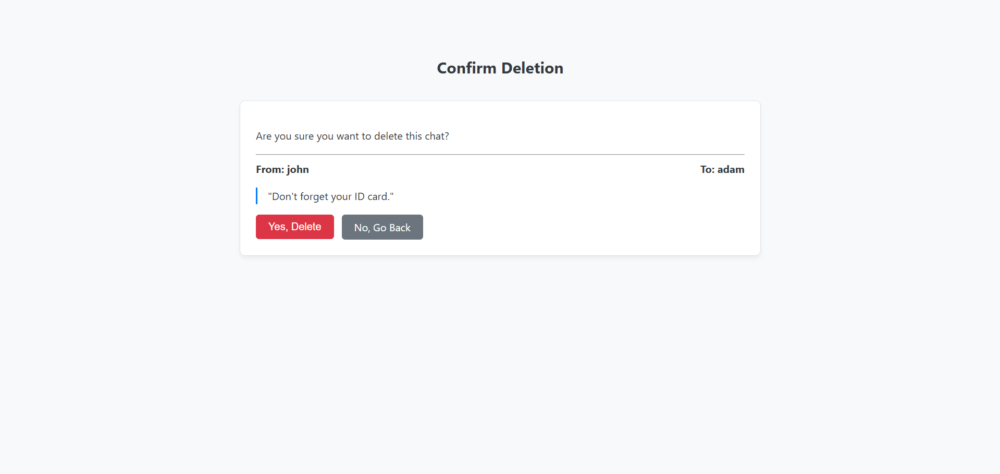

# Mini Chat - A Node.js & MongoDB CRUD Application

A simple, backend-focused web application that demonstrates the core principles of building a server-side application with Node.js, Express, and a MongoDB database. This project serves as a practical implementation of CRUD (Create, Read, Update, Delete) operations through a REST-like API.

## Core Focus: Node.js and MongoDB Integration

This project was built primarily to practice and demonstrate the connection and interaction between a Node.js server and a MongoDB database. The key learning objectives implemented are:

- **Database Connection:** Establishing and maintaining a stable connection to a local MongoDB instance using Mongoose.
- **Schema & Model Design:** Defining a structured schema for the "Chat" data using Mongoose, including data types, validations (`required`, `maxLength`), and timestamps.
- **ODM (Object Data Modeling):** Using the Mongoose model to interact with the database, abstracting away complex MongoDB queries into simple JavaScript functions.
- **CRUD Operations:**
  - **Create:** Adding new chat documents to the database (`Chat.save()`).
  - **Read:** Fetching all chats (`Chat.find()`) or a single chat (`Chat.findById()`).
  - **Update:** Modifying an existing chat document (`Chat.findByIdAndUpdate()`).
  - **Delete:** Removing a chat document from the database (`Chat.findByIdAndDelete()`).
- **Server-Side Rendering:** Using Express to handle routes and dynamically render data from the database into EJS templates.

## Features

- **View All Chats:** An index page that displays all chats stored in the database.
- **Create a New Chat:** A form to create and submit a new chat message.
- **Update a Chat:** The ability to edit the message of an existing chat.
- **Delete a Chat:** Functionality to permanently remove a chat from the database.
- **View Chat Details:** A dedicated page to see the complete details of a single chat.

## Technologies Used

- **Backend:** Node.js, Express.js
- **Database:** MongoDB
- **ODM:** Mongoose
- **Templating Engine:** EJS (Embedded JavaScript)
- **Middleware:** Method-Override (to handle PUT and DELETE requests from HTML forms)

## Screenshots

_1. The main page, listing all chats._


_2. The 'Create New Chat' page with its form fields._


_3. The 'View Chat' page showing a single Chat in detail._


_4. The 'Update Chat' page, allowing to update Chat message._


_5. The 'Delete Chat' page, allowing to delete Chat._


## Setup and Installation

1.  **Clone the repository:**

    ```bash
    git clone [https://github.com/RutvijDev/node-mongo-crud-practice.git](https://github.com/RutvijDev/node-mongo-crud-practice.git)
    ```

2.  **Navigate to the project directory:**

    ```bash
    cd node-mongo-crud-practice
    ```

3.  **Install the required dependencies:**

    ```bash
    npm install
    ```

## How to Run the Application

1.  **(Optional) Seed the database with initial data:**
    The project includes a script to populate the database with sample chats. This script (`init.js`) imports the `Chat` model, which is defined in the `models/chat.js` file. The `chat.js` file contains the Mongoose schema that dictates the structure of the data (e.g., `from`, `to`, `msg`). Running the script will insert several chat documents that conform to this schema.

    ```bash
    node init.js
    ```

2.  **Start the server:**

    ```bash
    node index.js
    ```

    _For development, it is recommended to use `nodemon` to automatically restart the server on file changes:_

    ```bash
    nodemon index.js
    ```

3.  **Open your browser:**
    Navigate to `http://localhost:8080` (or the port you specified in your `.env` file).
